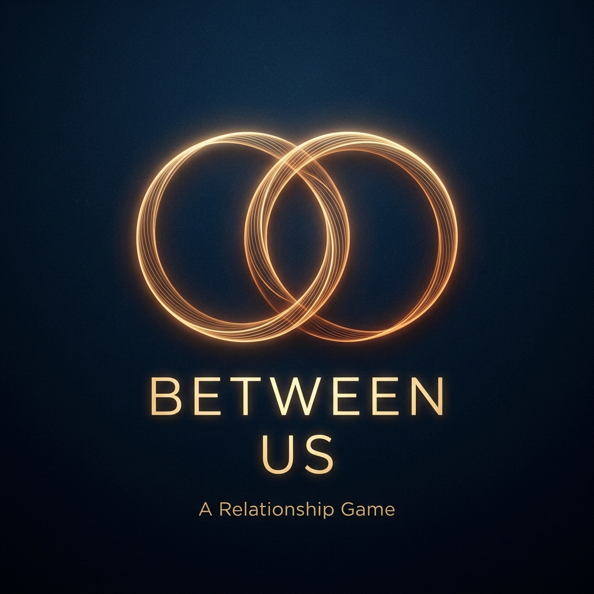

# Between Us ✨

**Between Us** is a cinematic, emotionally immersive relationship experience designed for two people. It facilitates honest connection through a series of "Phases" where players take turns answering thought-provoking, deep-discovery prompts.

<div align="center">
  
</div>

## ✨ Features

- **Cinematic Startup Intro**: A smooth, high-atmosphere startup sequence with evocative quotes.
- **Player Personlization**: Dynamic player name entry that personalizes the entire flow.
- **Atmospheric Backgrounds**: Deep, pulsing radial gradients and cinematic blur effects.
- **Safe Pass-the-Phone Interaction**: Guided turn-taking with "Privacy Screens" to ensure honest responses.
- **Shared Reveal**: A synchronized reveal sequence designed to be viewed together.
- **The Thread**: A final summary of all shared revelations to keep the conversation going.

## 🛠️ Tech Stack

- **React 19**
- **Vite**
- **Tailwind CSS 4** (using the new `@theme` engine)
- **Framer Motion** (for the cinematic animations)
- **TypeScript**

## 🚀 Quick Start

### Prerequisites
- Node.js (v18 or higher)
- npm or yarn

### Installation
1. Clone the repository
2. Install dependencies:
   ```bash
   npm install
   ```
3. Copy the environment variables:
   ```bash
   cp .env.example .env
   ```
4. Start the development server:
   ```bash
   npm run dev
   ```

## 📦 Deployment

### Vercel (Recommended)
The easiest way to deploy is using the Vercel CLI or by connecting your GitHub repository:
1. Push your code to GitHub.
2. Import the project into Vercel.
3. Vercel will automatically detect Vite and use `npm run build` with the `dist` directory.

### Netlify
1. Connect your repository to Netlify.
2. Build Settings:
   - Build Command: `npm run build`
   - Publish Directory: `dist`
3. Add any environment variables from `.env.example` in the Netlify Dashboard.

## 📂 Project Structure

```text
src/
├── components/      # Reusable UI components and screens
├── data/            # Game logic and phase definitions
├── types/           # Type definitions
├── App.tsx          # Main application orchestration
└── main.tsx         # Entry point
```

## 🎨 Future Scaling
The project is built with modularity in mind. You can easily:
- Add new phases in `src/data/phases.ts`.
- Integrate AI-driven prompts by enabling the Google Generative AI hooks.
- Add soundscapes and haptic feedback for deeper immersion.

---
Created with ❤️ for humans who want to connect.
